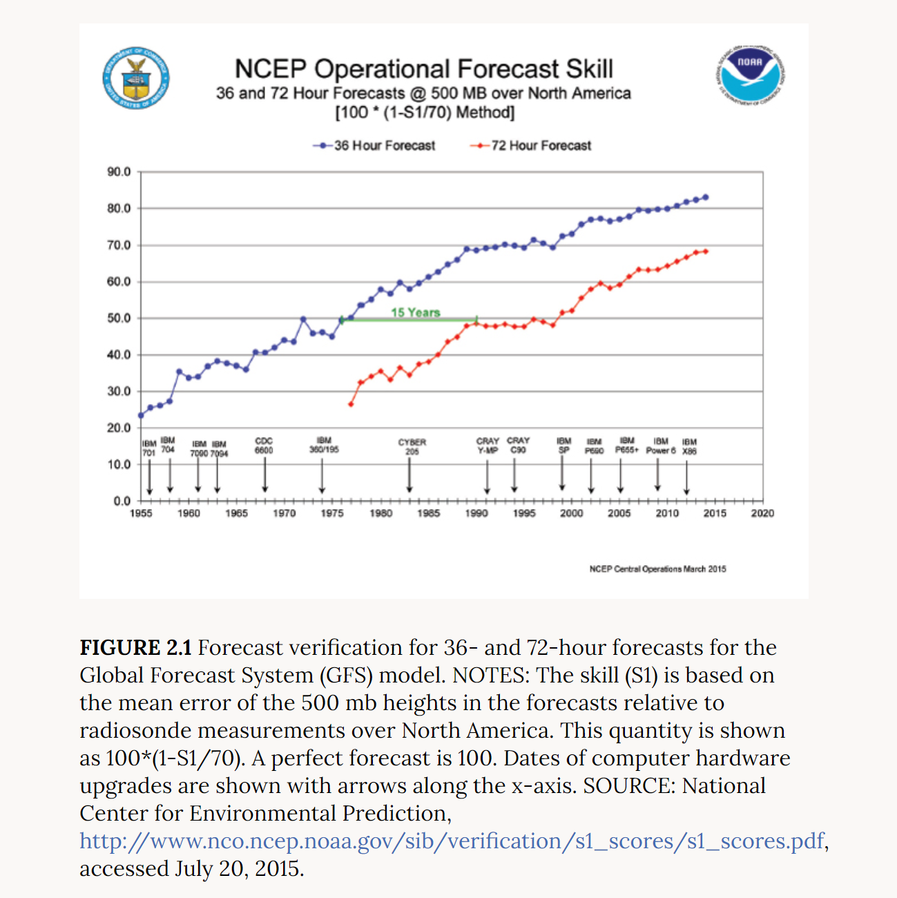

```{r setup, echo = FALSE, include = FALSE}
knitr::opts_chunk$set(echo = FALSE)
# install.packages("devtools")
# devtools::install_github("ebimodeling/biocro")
```

### Understanding NoAA

{#noaa_skill style="color: red"}

-   According to the graph, forecast skill of the Global Forecast system in the NoAA weather graph is defined as a quantity given by 100\*(1 - S1/70) where skill (S1) is based on mean error of the 500 mb heights in the forecasts relative to radiosonde measurements over North America.
-   It is said that they are using S1 as mean error. However, given the way the values are all positive, it is not so clear that they are using mean error as mean error can be positive or negative.
-   Plausible skill measures: RMSE, MAE are some of the skill measures that one can consider. Chi-square test is often used for goodness of fit testing when the data is divided into groups (or) for a discrete case. In our case too, can we create groups for comparison?

### Data Provided:

```{r, echo = FALSE}
## Justin's code for climate input to the model.

climate = read.delim(file.path("~/imsi/Internship/data", 'filled_climate.tsv'))
#climate = subset(climate, year == 2016 & doy > 167)  # According the these notes dated June 16, sorghum at SoyFACE had emerged, but not at the Energy Farm. It's a decent estimate.
climate = subset(climate, year == 2017 & doy > 151)
climate = climate[c('year', 'doy', 'hour', 'par', 'temperature', 'relative_humidity', 'windspeed', 'precipitation')]
names(climate) = c('year', 'doy', 'hour', 'solar', 'temp', 'rh', 'windspeed', 'precip')
climate = within(climate, {
    rh = rh / 100  # dimensionless. NOAA reports relative humidity as a percent of saturated vapor pressure.
    solar = solar * 4.6  # micromole / m^2 / s. The NOAA sensor outputs micromoles / m^2 / s and they divide by 4.6 to convert to W / m^2 / s. See excerpt from NOAA SURFRAD README above.
    precip = precip * 25.4  # mm. NOAA reports precipitation in inches.
    time = doy + hour / 24
    doy_time = doy * 24 + hour
    # WindSpeed  # m / s.
    # temp  # degrees Celsius.
    # hour  # 0 - 23.
})

climate = climate[complete.cases(climate), ]
head(climate)
```


