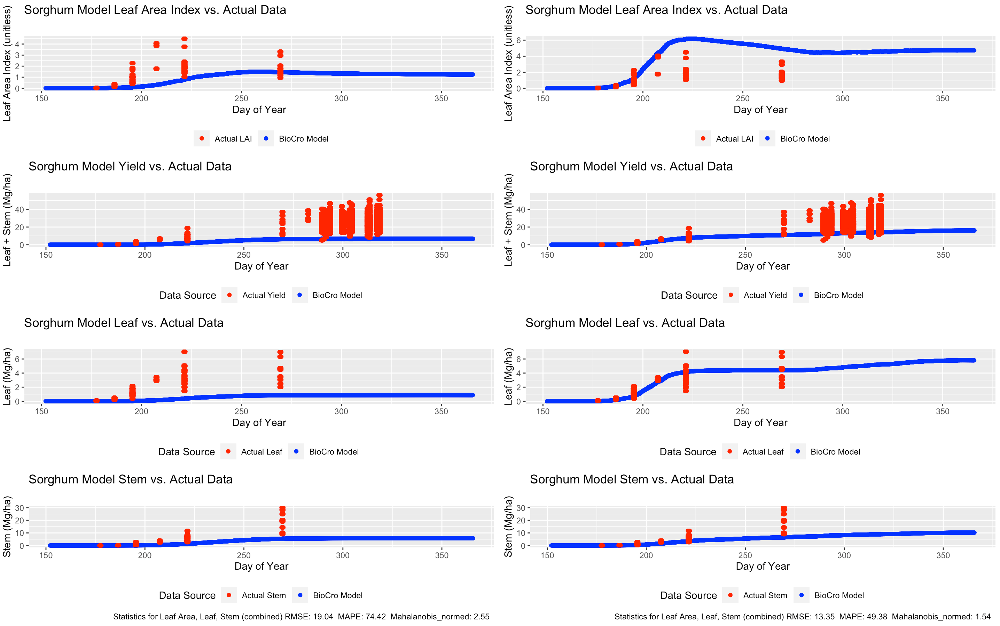
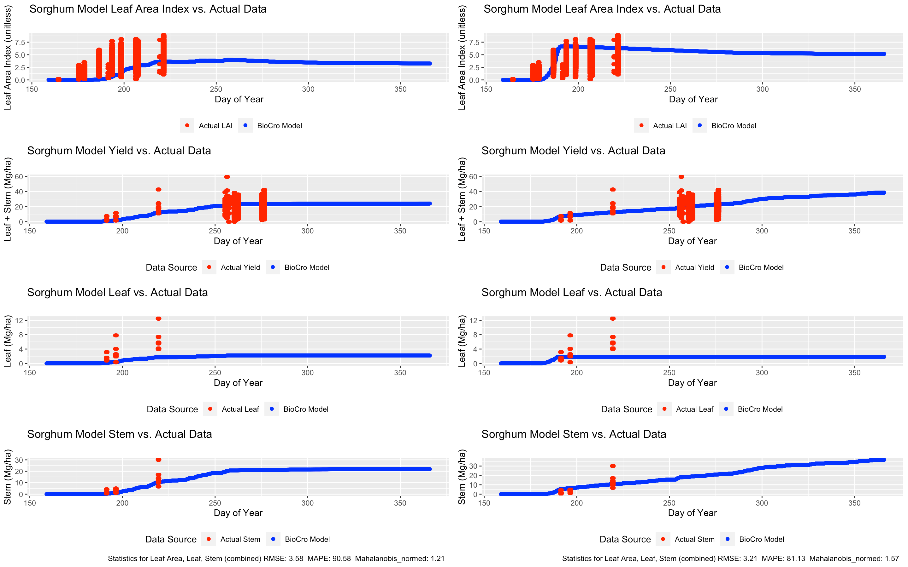
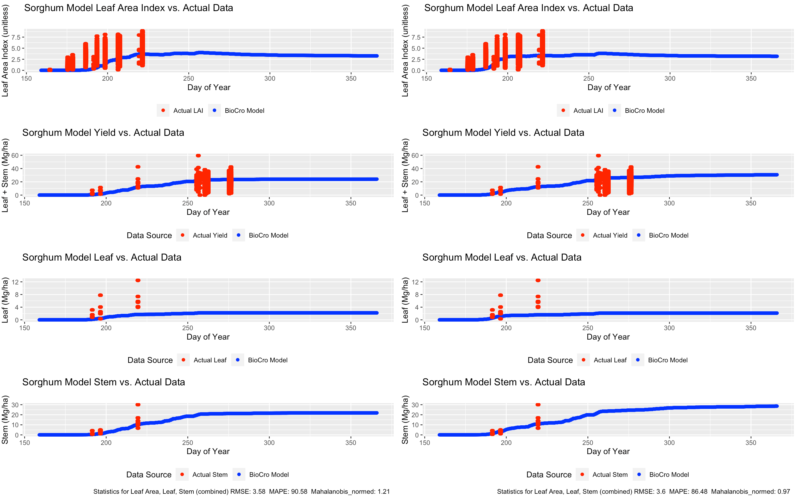

## 1. Project Summary:

USDA has an R private package called "BioCro" that uses various crop, soil related parameters and inputs changing weather conditions to model growth of a plant for various types of crops such as Soybean, Sorghum, Miscanthus, and more. The modeling uses a mechanical kind of approach by using multiple parameters to virtually model the growth of the crop. The model estimates dynamic values such as areas, mass of leaf, stem, grain, root based on the changing weather with the idea that the thermal time has a strong relationship to the growth of any plant. The model currently has many versions according to the modules that are used to dynamically grow the plant and each version of the model has many parameters.

The model version we worked on was using a partitioning logistic module and the crop we worked on to start off with is sorghum. In this sorghum, the yield is evaluated as the weight of leaf per unit area. The aim of the project was to find appropriate actual values of yields, areas so as to compare the model with the actual and in some way find the parameters that are optimal (gives the best fit). In some sense, we also sought to find the appropriate loss definition minimizing which gives a reasonable fit. We started off with squared error loss, absolute loss but then stuck with a normed mahalanobis loss that takes into account the different variances in various outputs and also the number of data points at a particular time of growth.

The project also identified datasets with measurements throughtout the growing period and a dataset with only tractor harvesting measurements and intended to find if using just the tractor harvesting measurements may give a good fit.

We obtained that using the data from the entire growing season will allow for improved normed mahalanobis statistic. Also using this statistic is very important in comparison to others since using other statistics might bias towards harvest season due to its yield values which are high. If the final yield is only what we intend to predict, then one can maybe use the harvest data only but since the importance of the biocro model is also drawn due to its outputs throughout the season it makes more sense to find parameters that fit the entire curve well which is only done by the normed mahalanobis statistic or by using equally spaced equal number of data points through out the growing season.

Better conclusions can also be made using subject matter judgment giving priority of yield, lai in some numerical fashion. Currently, 'more data' seems better overall however inclusion of LAI data from the growing season can give scores that are reasonable. In such case, gathering data at least for partitioning sake and biomass yield during the season can be avoided.

\newpage

## 2. Lab Approval:

Permissions for future use of report: The report summary only may be used for reporting to the National Science Foundation and on the IMSI website. IMSI reserves the right to use nontechnical excerpts from the rest of the report in public facing documents without identifying the intern or host. If for any reason IMSI wishes to use excerpts of the other parts of the report with attribution, permission would first need to be obtained the from the author and the author's sponsor organization. I have reviewed this report and approve of its release for IMSI internal use, and I approve of the project summary for public release.

\newpage

## 3. Introduction and Problem Statement:

BioCro is a package of models that predict crop growth over time given crop-specific parameters and climate data as input. It is a system of C++ modules, each containing one or more differential or non-differential equations, based on models of key physiological and biophysical processes underlying plant growth.

There are several different working versions (comprised of lists of modules to use) of the model. Only the modules selected to be used will affect the outcome of the model.

### Objectives:

-   Find and clean the climate dataset for places with available real data of plant yield or leaf area.

-   Identify suitable training and test data sets.

-   Define an appropriate loss function.

-   Optimize subset of parameters to fit the model's yield and lai to the actual.

-   Validate the model on the test datasets yield or lai.

-   Use the above procedure for sorghum model with "partitioning logistic module"

-   Draw figures illustrating the model comparison using all data and only harvest data.

\newpage

## 4. Methods:

Since the data was most complete for 2017, 2018, for both harvest only data and combination of two datasets, we chose these to evaluate the model. The method involved choosing appropriate dataset (actual) and at least a set of starting parameters to get an initial model dataset and finding an appropriate measure of loss that can optimize the model parameters better.

While some of the parameters were obtained from literature, some were roughly drawn initially based on similar values from other crops. This did not give a reasonably good graph but was then optimized based on the Normed Mahalanobis distance that was appropriate for this scenario.

The challenges that this data posed was two fold: scarcity of data in the growing season implies that a mechanical model that has parameters on how the plant grows can barely obtain reasonable parameters. Secondly when mixed with harvest data, abundance of data in one time point and scarcity in other can lead to over fitting at the time point with abundant information but under fitting during the growing season. Note that the model has parameters that can inform the growth through out the season and it is one of the advantages of this model to be able to predict growth at any time point. In such case and when the parameters don't have a very straightforward impact on the growth of plant like linear etc, it is preferable to somehow grow the reduce the importance of those that are high in count and have a measure that reasonably fits for most time points. This led to noting the Normed Mahalanobis distance which standardizes the errors both by variances and count thus giving equal weightage to every aspect such as Leaf, Stem, Yield, Leaf Area and count per time point.

Prior to coming across Mahalanobis distance, the usual loss functions were used such as RMSE, Chi-Square, MAPE, MAE, however it was noted that due to the change in variances of stem yield, leaf yield, lae which we were basing our results on, these did not improve the overall graph of the plant in an expected manner. Note that while the best way of using mahalanobis distance could be by using the covariance function, we used variances in each of the y variables namely lai, stem yield, leaf yield separately treating them as independent. With significantly more data, approaches to find the right covarinace structure may be more beneficial.

The Mahalanobis loss function is defined as follows with the notation that i ranges as different "doy"'s (day of year) where the actual data is available, and j ranges as different data points within each "doy". Also although the model gives us the value of growth of plant at each hour, we take the average to get it at a daily level (thus we have $\bar{y}_{model, i}$. Using the various values obtained at each day, we obtain $s^{2}$ as an estimate of $\sigma^{2}_i$, variance at a particular doy.

$$Mahalanobis  = \sqrt{\sum_{i} \sum_{j}\frac{(LAI_{ij} -  \bar{LAI}_{model, i})^{2}}{s^{2}_{i, LAI}}   + \sum_{i} \sum_{j}\frac{(yield_{ij} -  \bar{yield}_{model, i})^{2}}{s^{2}_{i, yield}}  }$$ However, soon we realized that the mahalanobis distance only standardizes for variance changes for days and also increases as number of days increase. Thus, we realized that it is skewing the results towards time periods where there are more data points and not giving a consistent graph of yield or lai with existing expectations.

Thus, we used the normed Mahalanobis which is given as follows in [@winter2010normalized]: $$Normed \ Mahalanobis  = \sqrt{\sum_{i} \sum_{j}\frac{(LAI_{ij} -  \bar{LAI}_{model, i})^{2}}{s^{2}_{i, LAI}}   + \sum_{i} \sum_{j}\frac{(yield_{ij} -  \bar{yield}_{model, i})^{2}}{s^{2}_{i, yield}}  }$$ It is also imperative to note that the "hjkb" optimization procedure does derivative free optimization of the parameters when provided with bounds. However, starting point is very crucial in the amount of time taken. It is sometimes also crucial to know the best possible value of normed mahalanobis so as to limit evaluations to wait entire days for convergence. While it may take an entire day to minimize the mahalanobis normed from 3.5 to 1.6, it was observed that it takes only a few minutes or seconds to minimize the mahalanobis normed fom 2.5 to 1.7. Starting with 2.5 score implies use of a reasonable starting parameters and ending with 1.7 could be a result of setting optim controls with a maximum evaluation scheme or a target.

## 5. Results:

### 5a) All data including harvest and during the growing season

Using a reasonable starting point for parameters (saved in \~/results/Surya_init_params/init_params1_2017_alldata.txt), I started with a mahalanobis score of 2.55. One can observe that the normed mahalanobis reduced significantly for training data but almost remained at the same value for test data when using all data. Note that some of the starting points almost gave a model growth of a flat line in comparison to the actual yields. The starting point that has been given here is obtained after optimizing a tiny bit.

+--------------------------------+-----------+-------+--------------------+
| Year/Set/Data                  | RMSE      | MAPE  | Mahalanobis Normed |
+================================+===========+=======+====================+
| 2017/Initial/Training/All_data | 19.04     | 74.40 | 2.55               |
+--------------------------------+-----------+-------+--------------------+
| 2017/Final/Training/All_data   | 13.35     | 49.38 | 1.74               |
+--------------------------------+-----------+-------+--------------------+
| 2018/Initial/Test/All_data     | 3.58      | 90.58 | 1.21               |
+--------------------------------+-----------+-------+--------------------+
| 2018/Final/Test/All_data       | 3.21      | 81.13 | 1.57               |
+--------------------------------+-----------+-------+--------------------+

Testing Data improvement:

From the training data set (2017) and the testing data set (2018), the leaf was ignored by the initial parameters and has since improved significantly giving a better fit to match the actual for many days in the plot. However one can also observe that there is an

Similarly doing the same with the same initial parameters, we run with only the harvest data set to optimize and observe the kind of improvement.

### 5b) Harvest Only Data

The harvest dataset for 2017 consists of observations only from doy 260 to 320 whereas the growing season starts from doy = 160 approximately. In this case, we fit based on loss function obtained from harvest yield and lai without using partitioning or without using biomass yield during the season.

Using the same parameters for initial parameters, we fit only using the harvest data but then validate across all data to find a like for like comparison. So we use a statistic based on only the leaf area and yield data to fit and then based on parameters obtained, we validate on entire 2017 and 2018 datasets using the prior complete data. On the harvest only dataset

+------------------------------+-----------+-------+--------------------+
| Year/Set/Data                | RMSE      | MAPE  | Mahalanobis Normed |
+==============================+===========+=======+====================+
| 2017/Fitting/Harvestonly     | 19.31     | 74.01 | 0.67               |
+------------------------------+-----------+-------+--------------------+
| 2017/Validation/Alldata      | 13.29     | 48.66 | 1.97               |
+------------------------------+-----------+-------+--------------------+
| 2018/Testing/All_data        | 3.6       | 86.48 | 0.97               |
+------------------------------+-----------+-------+--------------------+

\newpage

In essence, we observe that the mahalanobis are on comparable terms if similar number of data points are chosen overall. The 'harvest only' model has higher values of "Mahalanobis Normed" score of 1.97 compared to 1.74, atleast on the 2017 complete dataset where it was trained. On the other hand, in the 2018 testing dataset, 'harvest only' model has somehow obtained a lower score of 0.97 compared to the 1.57 when the entire data is used. Investigating the graphs of 2018 further:

When observed closely, it is clear that this was only due to a better fit of "leaf area" which was also included in the dataset with "harvest_only" yield. Therefore, by ensuring "leaf area" is at least observed more often, and using harvest only yield, it seems like there is a possibility of a reasonable model. Else, if yield through out the growing period has to be fit well, data from the growing season is also important.

We observe the following disadvantages of other statistics and advantages of normed mahalanobis for this kind of problem:

1)  Regular RMSE does not take into consideration the variances in observations from various time periods and different values such as yield, leaf area and is very sensitive to outliers.

2)  MAPE gets extremely skewed at the initial phases of growth of a plant. Observations close to zero warrants very low deviation or else it is punished whereas it should be noted that the plants may start differently which is not taken into consideration. This should be given some consideration as the variance at the start can be higher than a value close to zero. MAPE often punishes if the values are slightly deviant as well. It also produces infinite or undefined values when actual values are zero or even close to zero.

3)  Normed Mahalanobis on the other hand calculates standard deviation separately and thus even during the start of the season taken into consideration of slightly higher variances and also gives equal weight for all time points where the data is observed thus giving a clean curve.

## 6. Conclusions:

Definitely observing more datapoints throughout the growing period helps in accurately getting all required parameters for these dynamic models.

It is probably helpful or encouraged to collect equal and sufficient number of data points on each of the collection days and that too spread equally across time of growth of model so as to not bias the model parameters to fit a particular region much better than the other regions.

If at least LAI is collected regularly and yield on the harvest season, the overall mahalanobis seems pretty comparable. A better way could also be to use separate mahalanobis scores for yield, lai and thus having the choice to prioritize one over the other in making a decision in favor of entire dataset vs. harvest only dataset.

We found that with more data points from a particular time period, the model sometimes fits that time period better. However the normed mahalanobis that was discussed from [\@winter2010normalized] ensures that this is slightly less of a problem.

Also, having enough datapoints throughout the growing season may help generate a reliable covariance structure between the observed values such as stem yield, leaf yield, lai across time. This ensures that we can use a covariance based mahalanobis statistic rather than using assumption of independence.

## Acknowledgements:

Thanks to Stark Ledbetter for constant interaction and a lot of coding ideas and help. Thanks a ton to Dr. Justin McGrath for devising an interesting project and giving us an opportunity, Dr. Ed Lohocki for an excellent introduction to BioCro. Overall, a lot was learnt from just the few days of experience with using BioCro. Thanks a lot to IMSI for funding and allowing such an incredible experience.

## References:
